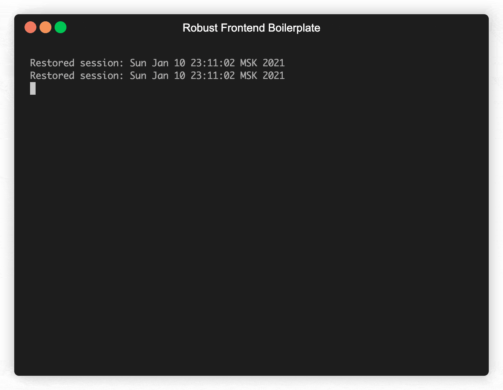

# Robust Frontend Boilerplate

## Description
When I start a project, I always want to spend a minimum of time on the preparatory stage.
That is why the boilerplates were developed, as well as a small CLI for automated start.

### Boilerplate

- ⚪ [Native Application](native)
- 🔵 [React Application](react)

## How to use?

> Check out and select the boilerplate you need (each of them is in its own folder).

### Step 1

Clone the repositor:

```sh
$ git clone https://github.com/viczhuravlev/robust-frontend-boilerplate.git NAME_YOUR_REPOSITORY
```

### Step 2

Run CLI, which will help you prepare the boilerplate you need and install dependencies:

```sh
$ yarn start
```



### Step 3

Follow the setup instructions in the boilerplate of your choice.

## Contributing

I appreciate any support in development the project and looking forward to your PR. 😉

## License

This material is available for private, non-commercial use under the
[GPL version 3](http://www.gnu.org/licenses/gpl-3.0-standalone.html). If you
would like to use this material to conduct your own workshop, please contact me
at vzhuravlev15@gmail.com
